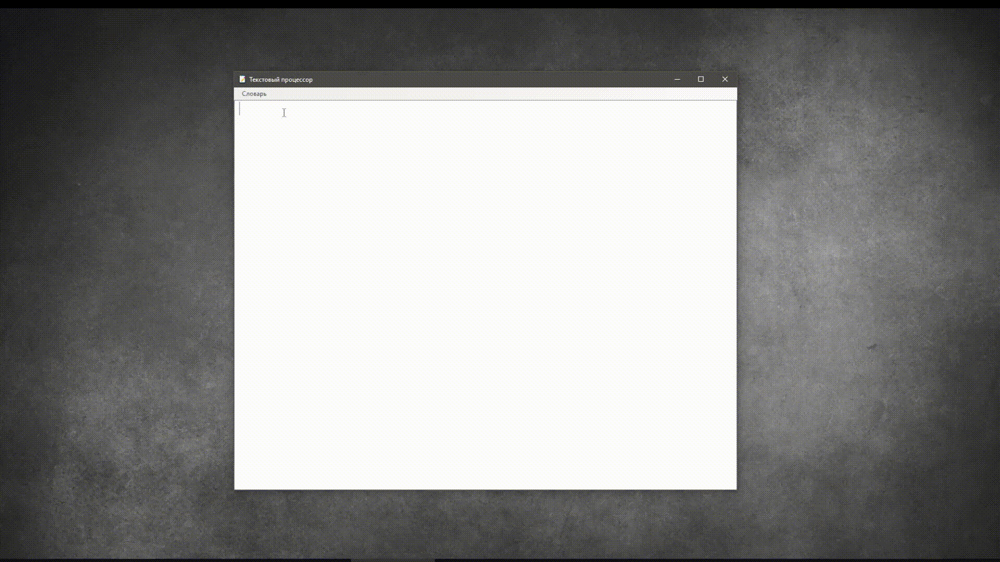
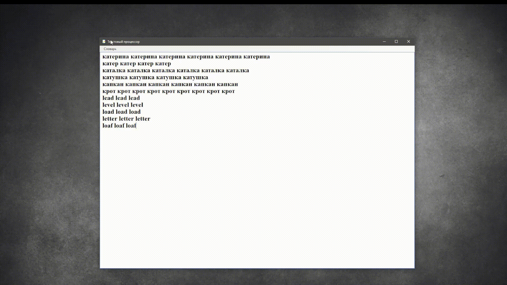
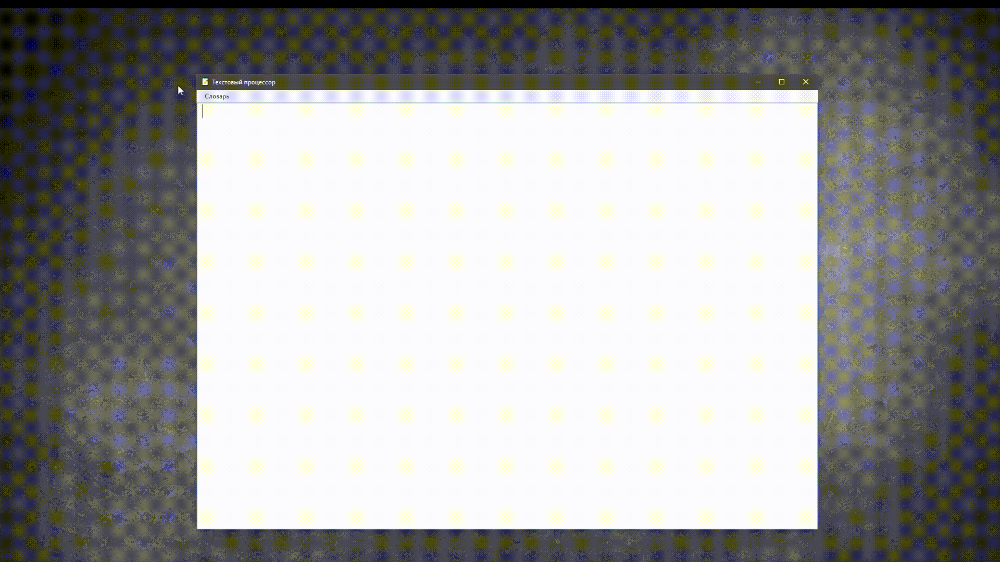

# Текстовый процессор :page_with_curl:
*(Реализующий автодополнение слов по требованию пользователя)*

#### Скачать проект: [Проект.zip](https://disk.yandex.ru/d/eDCh_bWoEpCJ5g](https://disk.yandex.ru/d/77CfvZeBcMatbA))
____

### Функции процессора:
+ Загрузка и анализ (входящего) текстового файла для формирования словаря «часто встречающихся слов».
+ Сопровождение словаря с помощью кнопок в верхнем меню программы.
+ Вывод подсказок (автодополнений) к словам в соответствии со сформированным словарём.
___
 ####  Используемые технологии: 
:heavy_check_mark: ***Visual Studio 2022***  
:heavy_check_mark:   ***Windows Forms*** 
:heavy_check_mark:   ***ООП*** 
:heavy_check_mark:  ***ADO.net*** 
:heavy_check_mark:   ***SQLite*** 
:heavy_check_mark:   ***LINQ***

 

 ##  1.Создание словаря :hammer:

 #### Условия создания словаря:
   * Поле ввода не должно быть пустым
 #### Результат:
  * Формирование нового словаря по входящему файлу  

 

## 2. Обновление словаря :recycle:

#### Условия добавления в словарь:
  * Минимальное число символов, воспринимаемых приложением как слово – 3.
  * Минимальное число повторений слова в тексте для включения этого слова - 3. 
#### Результат:
   * Дополнение существующего словаря по входящему файлу.
 

 

## 3. Очистка  словаря :x:
 
 #### Результат:
   * Удаление всех данных словаря.

-----
Выполнил: Белов Александр Сергеевич

----

